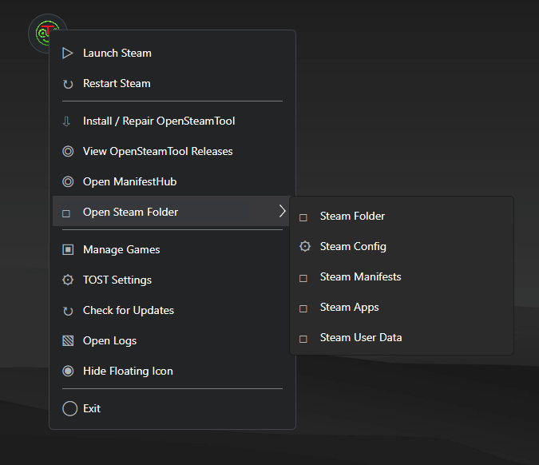
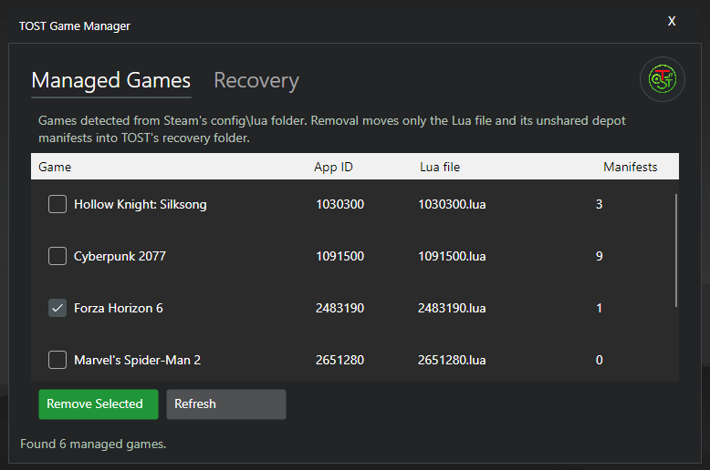
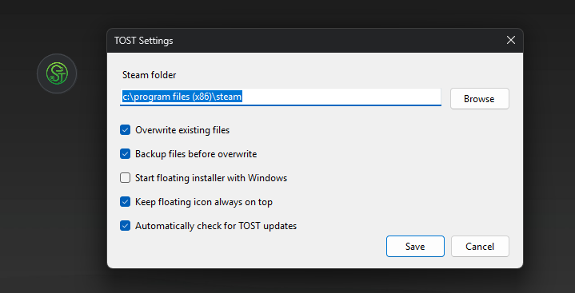
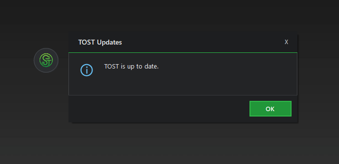
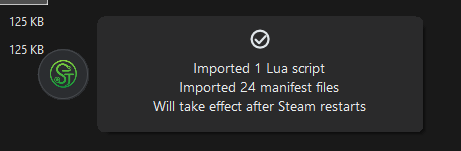

# TOST
**TRIONINE OPEN STEAM TOOL**

TOST uses one shared Avalonia floating desktop interface on Windows and Linux. On Windows it manages [OpenSteamTool](https://github.com/OpenSteam001/OpenSteamTool); on Linux it manages [SLSsteam](https://github.com/AceSLS/SLSsteam). The visible workflow stays the same while file routing and integration setup follow the active platform.

TOST is not the closed-source SteamTools app and has no ownership, maintenance, or endorsement from OpenSteamTool, SLSsteam, Valve, or Steam.

## Cross-platform development

Linux support is under active development on the `linux-support` branch. Shared,
platform-neutral behavior lives in `Core`; `CLI/Linux` is the current CLI
frontend. It supports native Steam, Flatpak Steam, SLSsteam diagnostics and
recovery, guarded configuration changes, and preview-first local file imports.

The shared Avalonia floating frontend lives in `Desktop`. It selects the
OpenSteamTool backend on Windows and the SLSsteam backend on Linux. Run it with:

```bash
dotnet run --project Desktop/TOST.Desktop.csproj
```

Linux imports route Lua to `config/stplug-in`, depot manifests to `depotcache`,
and app manifests to `steamapps`. TOST safely parses supported OpenSteamTool Lua
declarations without executing them, translates App IDs, tokens, and manifest
overrides into SLSsteam's official `config.yaml`, and registers depot keys in
Steam's `config/config.vdf`. Both configuration files are previewed, backed up,
and atomically replaced. Explicit DLC-parent mapping is still pending.

```bash
dotnet run --project CLI/Linux/TOST.Linux.csproj -- status
dotnet run --project CLI/Linux/TOST.Linux.csproj -- config
dotnet run --project CLI/Linux/TOST.Linux.csproj -- check-updates
dotnet run --project CLI/Linux/TOST.Linux.csproj -- install-slssteam
dotnet run --project CLI/Linux/TOST.Linux.csproj -- configure-launch
dotnet run --project CLI/Linux/TOST.Linux.csproj -- configure-launch --flatpak
dotnet run --project CLI/Linux/TOST.Linux.csproj -- launch-recovery
dotnet run --project CLI/Linux/TOST.Linux.csproj -- inspect-import ./game.lua ./123_456.manifest
dotnet run --project CLI/Linux/TOST.Linux.csproj -- import ./game.lua ./123_456.manifest
```

Mutating commands preview by default and require `--apply`. Run the complete
command list with:

```bash
dotnet run --project CLI/Linux/TOST.Linux.csproj -- help
```

Set `STEAM_DIR` when Steam uses a custom native root. Use `--flatpak` on commands
that need to select Flatpak Steam explicitly. TOST does not execute imported Lua
or unverified upstream installers, and does not claim that library visibility
guarantees download entitlement, launch support, multiplayer, or anti-cheat
compatibility. `install-slssteam --apply` downloads the portable asset from the
pinned official GitHub release, verifies its published SHA-256 digest, and
extracts only `SLSsteam.so` and `library-inject.so`.

`configure-launch` creates guarded native Steam wrappers; `--flatpak` creates a
per-user Flatpak environment override. Both preview by default. TOST refuses to
overwrite or remove hooks that are unmanaged or were modified after creation.
Removal archives managed hooks under TOST recovery storage; `launch-recovery`
lists them and `restore-launch <archive-id> --apply` restores guarded entries.

### Build and verify

The repository solution contains the shared Avalonia frontend, shared core,
Linux CLI, and dependency-free test runner:

```bash
dotnet build TOST.sln --configuration Release
dotnet run --project Tests/Core/TOST.Core.Tests.csproj --configuration Release
```

Publish a self-contained, single-file Linux x64 executable with:

```bash
dotnet publish CLI/Linux/TOST.Linux.csproj --configuration Release --runtime linux-x64 --self-contained true --output artifacts/linux-x64
chmod +x artifacts/linux-x64/tost
```

Pushing a version tag runs the GitHub release workflow. It tests and packages
Windows and Linux, creates one GitHub Release with a `What's new` list generated
from commits since the previous tag, and uploads all platform assets
automatically:

```bash
git tag v2.0.1
git push origin v2.0.1
```

No personal access token is needed because the workflow uses GitHub's scoped
token. The workflow can also be run manually for an existing tag from the
Actions page. Linux assets include the Avalonia desktop app plus the optional
`tost-cli` in a portable `.tar.gz`, an `x86_64.AppImage`, an Arch Linux
`.pkg.tar.zst`, and `SHA256SUMS-linux.txt`.
AppImage users can mark the file executable and run it directly; Arch users can
install with `sudo pacman -U tost-<version>-1-x86_64.pkg.tar.zst`.

## Screenshots
<details>
<summary>Click to expand screenshots</summary>

### Menu


### Game Manager


### Settings


### Dialogs and imports


</details>

## Features

- Floating icon and system tray controls
- Automatic OpenSteamTool installation/repair on Windows and checksum-verified SLSsteam installation/repair on Linux
- Drag-and-drop installation for local packages
- Game Manager for one-click removal and restoration of managed games
- Automatic Steam detection, file routing, and backups
- Import notifications, logs, and useful shortcuts
- Installed and portable builds with update support

TOST does not bundle OpenSteamTool files. Selecting
`Install / Repair OpenSteamTool` explicitly downloads the latest release ZIP
from the official OpenSteamTool GitHub repository and installs its supported
files. Local packages can still be imported by dragging them onto TOST.

## Requirements

- Windows 10 or newer, or a supported x64 Linux desktop
- An existing Steam installation

## Download

The recommended download is the `*-Setup.exe` asset on the
[TOST Releases](https://github.com/sadabx/TOST/releases) page. It installs TOST
for the current Windows user and enables in-place updates.

The `*-Portable.zip` asset is for Windows users who prefer no installation. Extract the
complete archive to a writable folder and run `TOST.Desktop.exe`. Keep every extracted
file together; the portable package is a directory-based application, not a
single standalone executable.

Linux releases provide a portable `.tar.gz`, AppImage, and Arch package. All use
the same Avalonia interface as the Windows build.

## Usage

- Use `Install / Repair OpenSteamTool` on Windows or `Install / Repair SLSsteam`
  on Linux to download and apply the latest official integration release.
- Drag supported files, folders, or ZIP packages onto the floating icon to
  import local packages.
- Use `Manage Games` to remove an imported game or restore previously removed
  files from TOST's recovery folder.
- Right-click the icon for the menu; double-click it to restart Steam.
- Double-click the system tray icon to restore a hidden floating icon.

### Automatic installation

When `Install / Repair OpenSteamTool` is selected, TOST:

1. Resolves the latest release from the official OpenSteamTool GitHub repository.
2. Downloads the non-debug release ZIP to a temporary location.
3. Validates the archive and copies supported files into the Steam directory.
4. Removes the temporary download when installation finishes.

Existing files are backed up before replacement when backups are enabled.
Restart Steam after installation so the new files take effect.

On Linux, the equivalent menu action downloads SLSsteam's portable release,
verifies its published SHA-256 digest, installs only the required libraries,
and configures the guarded native or Flatpak launch hook.

### Windows file routing

| File | Destination |
| --- | --- |
| `OpenSteamTool.dll` | Steam root |
| `dwmapi.dll` | Steam root |
| `xinput1_4.dll` | Steam root |
| `opensteamtool.toml` | Steam root |
| `*.lua` | `<Steam>\config\lua` |
| `appmanifest_*.acf` | `<Steam>\steamapps` |
| `*.manifest` | `<Steam>\steamapps` |

Steam is detected from
`HKCU\Software\Valve\Steam\SteamPath`. If unavailable, TOST falls back to
`C:\Program Files (x86)\Steam`.

On Linux, Lua files route to `config/stplug-in`, depot manifests to
`depotcache`, and app manifests to `steamapps`; supported Lua declarations are
converted into SLSsteam and Steam configuration without executing the Lua.

## Menu

- `Launch Steam`
- `Restart Steam`
- `Install / Repair OpenSteamTool` on Windows or `Install / Repair SLSsteam` on Linux
- The matching integration's official releases
- `Open ManifestHub`
- `Open Steam Folder`
- `Manage Games`
- `TOST Settings`
- `Check for Updates`
- `Open Logs`
- `Hide Floating Icon`
- `Exit`

## Settings and updates

Installed Windows builds store settings and logs under:

```text
%LocalAppData%\TOST\data
```

Portable Windows builds store them beside `TOST.Desktop.exe`. Linux builds use
the current user's local application-data directory.

### Game management

The Game Manager detects entries from `<Steam>\config\lua` and associates
depot manifests by reading the `addappid(...)` declarations in each Lua file.
Names come from the local Steam app manifest when available; missing names are
looked up from the Steam Store and cached locally for offline use.
Removing a game moves its Lua file and unshared `.manifest` files into:

```text
<TOST data>\removed-games
```

Removed files can be restored from the Game Manager. Manifests referenced by
another Lua file are retained. TOST does not remove `appmanifest_*.acf`, game
installations, saves, workshop content, or other Steam data.

Installed builds check
[TOST GitHub Releases](https://github.com/sadabx/TOST/releases) at most once
every 24 hours. Automatic checks can be disabled in Settings. Portable and raw
development builds can check the release page but do not modify themselves in
place.

## Safety

- Only recognized filenames and extensions are copied.
- Existing files can be backed up before replacement.
- Managed-game removal is recoverable and protects shared manifest files.
- ZIP packages with duplicate supported filenames are rejected.
- Oversized ZIP entries and payloads are rejected.
- Automatic downloads use the official OpenSteamTool GitHub release.
- Local third-party payloads require explicit drag-and-drop.

Only install files that you trust and have permission to use or redistribute.

## Project structure

```text
TOST/
|-- .config/
|   `-- dotnet-tools.json     Pinned Velopack CLI
|-- Assets/
|   |-- ss/
|   |   |-- TOST.png          Floating-menu preview
|   |   `-- game-manager.png  Game Manager preview
|   |-- TOST.png              Current Windows and Linux logo
|   `-- tost.ico              Application and installer icon
|-- Core/                     Shared Steam, import, integration, and recovery logic
|-- Desktop/                  Shared Windows/Linux Avalonia floating UI
|-- CLI/Linux/                Optional Linux command-line frontend
|-- Legacy/WinForms/          Inactive project file for the retained WinForms reference
|-- UI/                       Retained legacy WinForms source; not used by releases
|-- .gitignore
|-- LICENSE
|-- README.md
|-- TOST.sln                  Shared desktop, core, CLI, and tests
`-- build-release.ps1         Windows build and packaging script
```

<!-- Generated `bin/`, `obj/`, `artifacts/`, and `Releases/` directories are not
committed. -->

## Credits

### TOST

 Developed and maintained by [sadabx](https://github.com/sadabx) under
[TRIONINE](https://trionine.com/).

### OpenSteamTool

TOST uses the supported file layout and logo assets of the
[OpenSteamTool project](https://github.com/OpenSteam001/OpenSteamTool), which
remains owned and maintained by its contributors. This attribution does not
imply that OpenSteamTool created, owns, maintains, or endorses TOST.

## License

TOST is distributed under the GNU General Public License v3.0. See
[LICENSE](LICENSE).
